# 凡栋超市管理系统

## 1. 项目概述

凡栋超市（品牌名"木东超市"）是一款面向连锁超市场景设计的综合管理系统，覆盖后台管理、用户端微信小程序与 AI 智能客服三个核心维度。系统以 Spring Boot 为服务端核心，向管理员提供基于 Vue 3 的运营管理界面，向顾客提供原生微信小程序入口，并通过独立的 Python AI 服务提供自然语言商品咨询与导购能力。整体架构清晰、模块解耦、便于二次开发与部署。

## 2. 技术栈一览

| 模块 | 技术栈 | 说明 |
|------|--------|------|
| Java 后端 | Spring Boot 2.7.3, MyBatis + MyBatis-Plus 3.5.3, MySQL, Redis, JWT (jjwt 0.9.1), 阿里云 OSS, Knife4j 3.0.2 | 18 个 RESTful Controller，9 管理端 + 9 用户端 |
| Vue 管理后台 | Vue 3.4, Vite 5.2, Element Plus 2.6, Pinia 2.1, Vue Router 4.3, ECharts 5.5 | 10 模块管理界面，角色权限控制，Playwright E2E 测试 |
| 微信小程序 | 原生微信小程序（WXML/WXSS/JS） | 15 页 C 端购物体验，6 个自定义组件 |
| AI 智能客服 | FastAPI 0.104, LangChain, DashScope 通义千问 (qwen3-max), ChromaDB, MongoDB | SSE 流式导购，混合检索 (BM25 + 向量 + RRF) |

## 3. 项目目录结构

```
supermarket-system/
├── supermarket-system-backend/    # Java 后端，Spring Boot + MyBatis，提供 RESTful API
│   ├── sky-common/               # 公共工具类、常量、异常定义、属性配置
│   ├── sky-pojo/                 # 实体类、DTO、VO（数据传输对象）
│   └── sky-server/               # 核心业务服务，Controller/Service/Mapper 三层架构
├── supermarket-system-admin/     # Vue 3 管理后台，Element Plus 构建的运营管理界面
│   └── src/                      # 组件、页面、路由、状态管理、API 封装
├── mini-program-weixin/          # 微信小程序，原生开发
│   └── native-miniprogram/       # 原生小程序源码（.wxml/.wxss/.js/.json）
├── ai-customer-service-python/   # Python AI 智能客服，基于 LLM 的导购服务
│   ├── main.py                   # FastAPI 入口（端口 8083）
│   ├── app/                      # 核心模块（API/Config/Core/Schemas/Services）
│   └── agent/                    # 智能体（意图识别 + ReAct 双模式协调器）
└── sql/                          # 数据库初始化脚本
```

## 4. 系统架构设计

```
┌─────────────────┐     ┌──────────────────┐
│  微信小程序       │     │  Vue 管理后台     │
│  (用户端)         │     │  (运营管理端)      │
└────────┬────────┘     └────────┬─────────┘
         │                       │
         └──────────┬────────────┘
                    │ HTTP/JSON
                    ▼
          ┌─────────────────────┐
          │   Java 后端 API     │  端口 8080
          │  Spring Boot + JWT  │
          └──┬──────┬──────┬───┘
             │      │      │
      ┌──────┘      │      └──────────┐
      ▼             ▼                 ▼
  ┌────────┐  ┌──────────┐  ┌────────────────┐
  │ MySQL  │  │  Redis    │  │ Python AI 服务  │
  │ 持久化  │  │ 缓存/队列  │  │ FastAPI + LLM  │
  └────────┘  └──────────┘  └───────┬────────┘
                                    │
                          ┌─────────┴─────────┐
                          ▼                   ▼
                    ┌────────────┐    ┌────────────┐
                    │ DashScope  │    │  MongoDB   │
                    │ 通义千问 LLM │    │ 聊天历史    │
                    └────────────┘    └────────────┘
```

**数据流向说明**：用户通过微信小程序发起请求（浏览商品、加购、下单、客服咨询），HTTPS 请求抵达 Java 后端（端口 8080）；后端完成业务校验、订单写入与持久化。管理员操作经 Vue 后台以同一 API 网关进入后端。订单状态变更由小程序端轮询 `/user/order/historyOrders` 获取。当用户在小程序内触发 AI 客服时，小程序直接 SSE 连接 Python AI 服务（端口 8083），AI 服务结合 DashScope 通义千问大模型、ChromaDB 向量库与 MongoDB 聊天历史，完成意图识别、混合检索与多轮导购；AI 服务同时通过 HTTP 调用 Java 后端的商品接口获取实时数据，最终将导购结果以 SSE 流式推送回小程序。

## 5. 系统截图

### 5.1 微信小程序端

| 首页 - 分类商品浏览 | 确认订单 - 地址与优惠 |
|:---:|:---:|
| 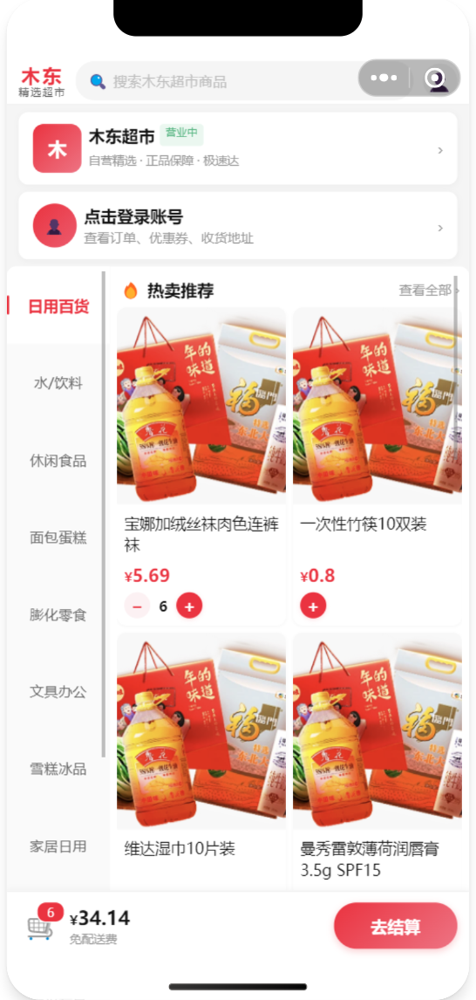 | 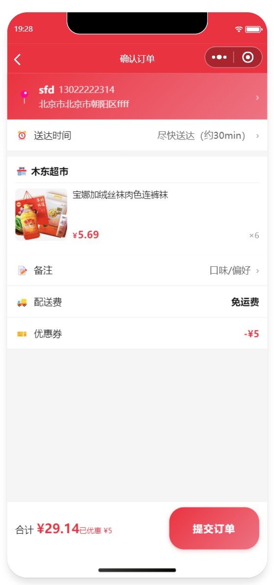 |

| 个人中心 - 订单与服务 | 领券中心 - 优惠券领取 |
|:---:|:---:|
| 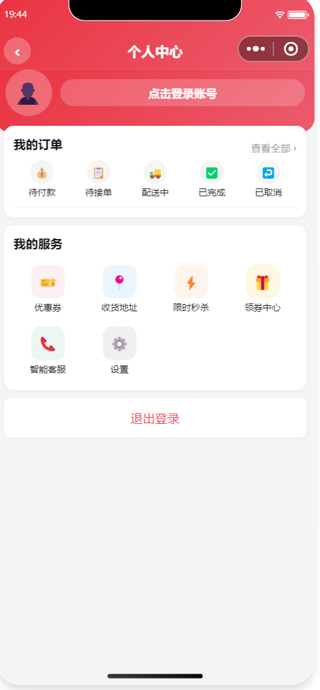 | 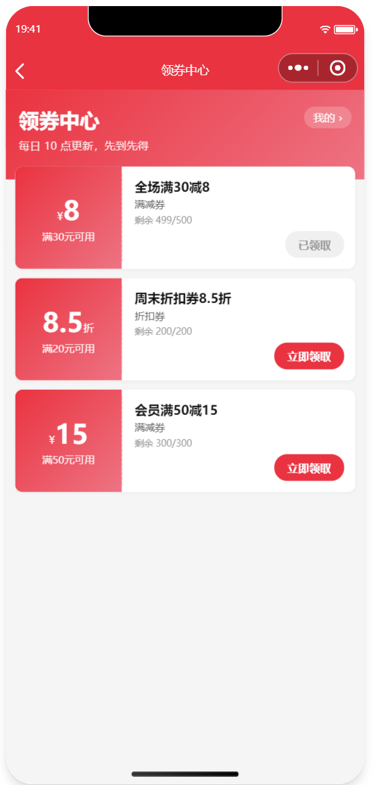 |

| 我的优惠券 | 限时秒杀 |
|:---:|:---:|
| 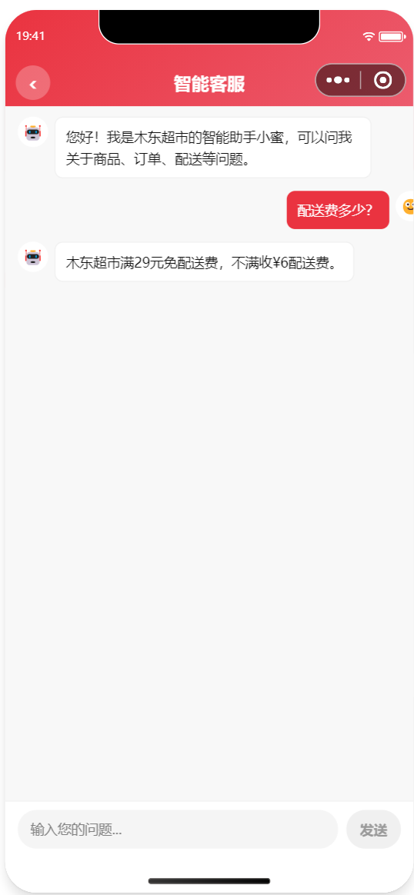 | 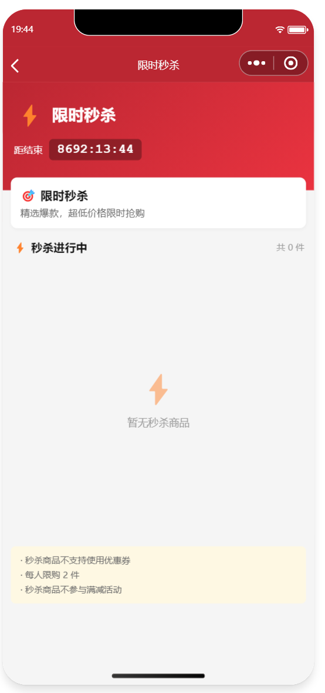 |

| AI 智能客服 |
|:---:|
| 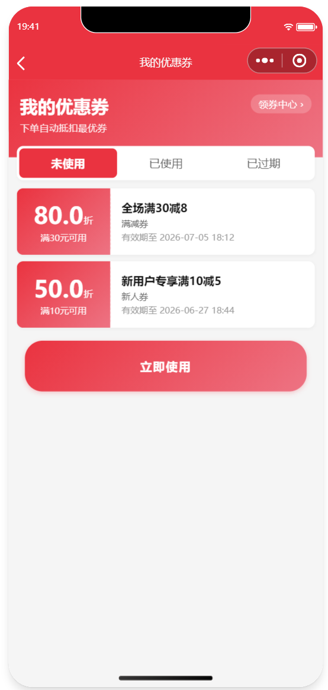 |

### 5.2 Vue 管理后台

| 工作台 - 统计仪表盘 | 订单管理 - 状态筛选 |
|:---:|:---:|
| 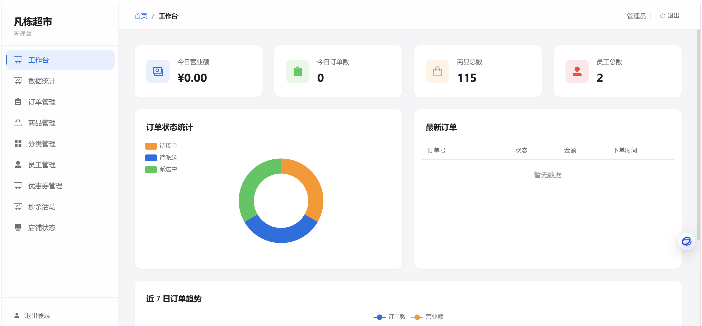 | 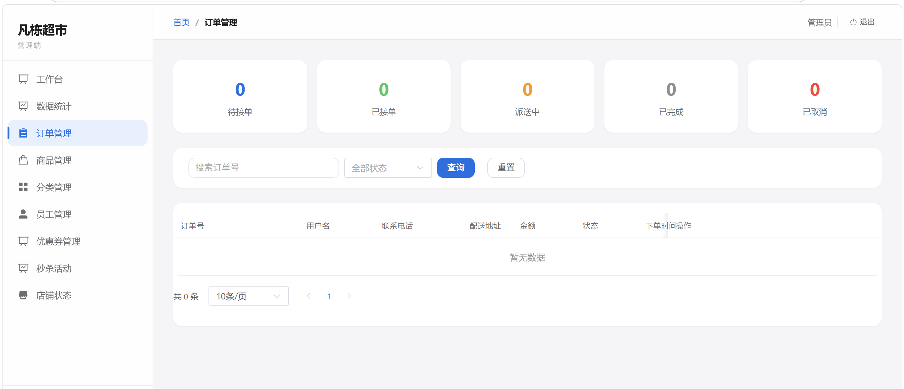 |

| 商品管理 - CRUD 与库存 | 分类管理 - 排序与状态 |
|:---:|:---:|
| 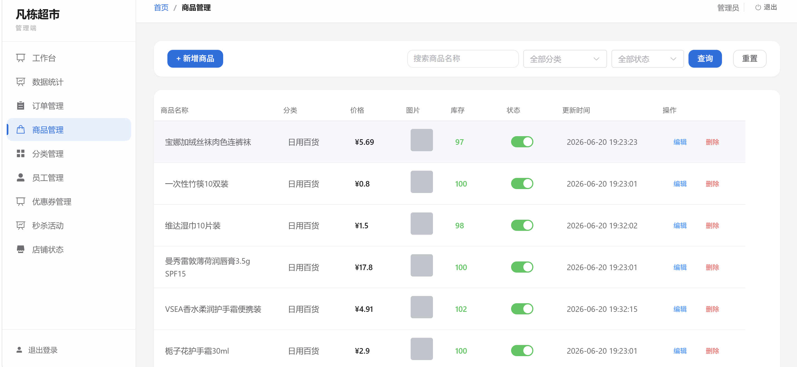 | 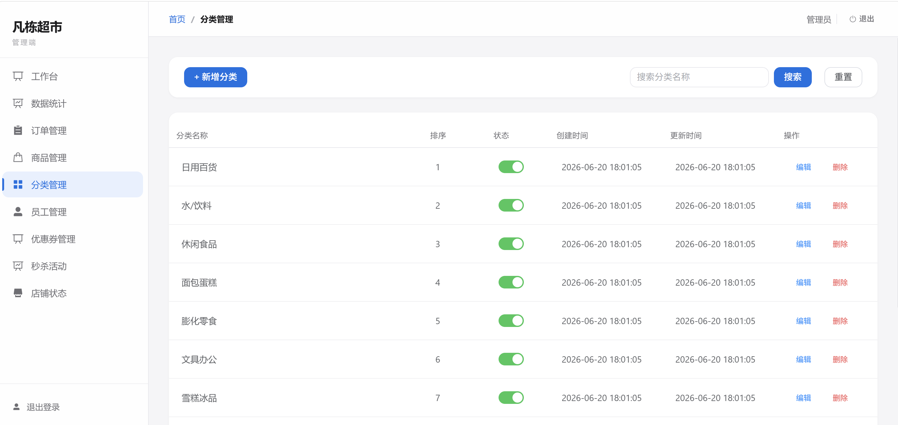 |

| 员工管理 - 角色权限 | 优惠券管理 - 多类型券 |
|:---:|:---:|
| 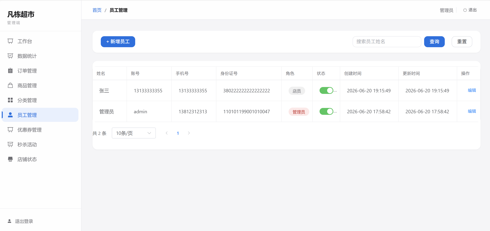 | 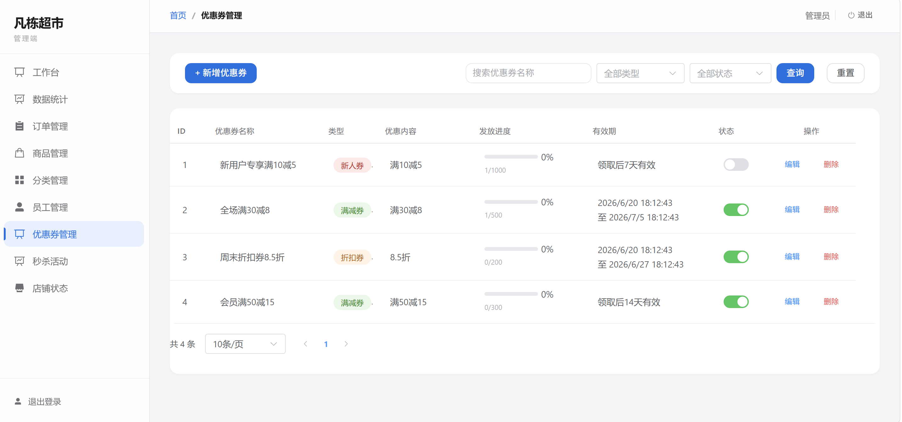 |

| 秒杀活动管理 | 店铺营业状态 |
|:---:|:---:|
| 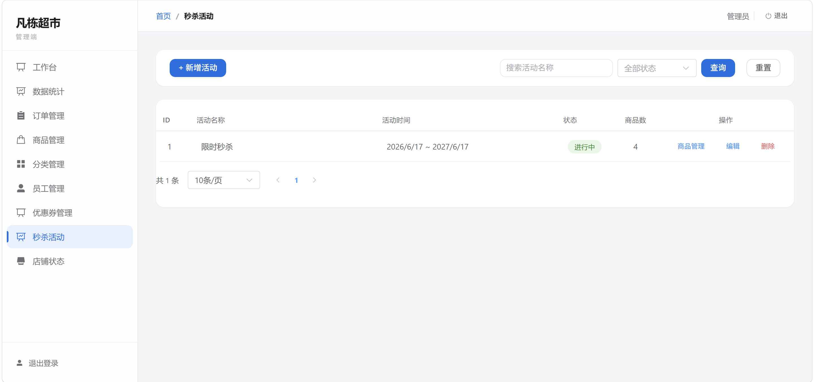 | 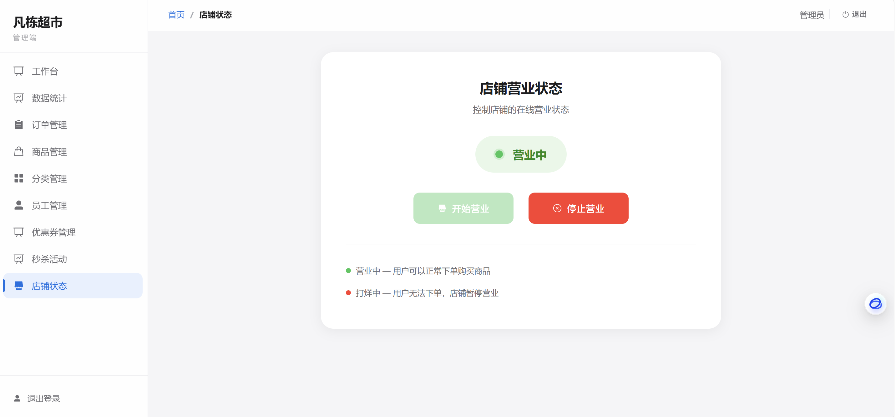 |

---

## 6. 核心模块说明

### 6.1 Java 后端 (`supermarket-system-backend/`)

#### 6.1.1 模块结构

```
supermarket-system-backend/
├── sky-common/          # 公共模块：工具类、常量、统一响应、异常、属性配置、上下文
├── sky-pojo/            # 数据模型：Entity、DTO、VO（无 Spring 依赖）
└── sky-server/          # 业务核心：Controller/Service/Mapper 三层 + 拦截器 + 配置
```

后端采用多模块 Maven 工程，按职责拆分。启动入口 `SkyApplication.java` 标注有 `@SpringBootApplication`、`@EnableCaching`、`@EnableTransactionManagement`、`@EnableScheduling`，默认监听 **8080** 端口。

#### 6.1.2 分层架构

| 层 | 数量 | 说明 |
|---|------|------|
| Controller | **18 个**（9 管理端 + 9 用户端） | 接收 HTTP 请求，调用 Service |
| Service + Impl | **10 对**（1:1 接口与实现） | 业务逻辑编排 |
| Mapper | **12 个**（9 个有 XML 映射） | 数据库访问，MyBatis + MyBatis-Plus |
| Entity | **12 个** | 数据表实体 |
| DTO | **20 个** | 请求数据传输对象 |
| VO | **15 个** | 响应视图对象 |

#### 6.1.3 管理端 Controller（9 个）

| Controller | 路径 | 功能 | 权限 |
|---|---|---|---|
| `EmployeeController` | `/employee` | 登录（签发 JWT）、CRUD、状态启禁 | admin |
| `DashboardController` | `/dashboard`, `/api/dashboard` | 工作台概览、统计报表、营业额/订单数趋势、订单状态统计 | admin/manager |
| `CategoryController` | `/category` | 分类分页、新增、启禁、编辑、删除、列表 | admin/manager |
| `CommonController` | `/common` | `POST /upload` → 阿里云 OSS 文件上传 | admin/manager |
| `CouponController` | `/admin/coupon` | 优惠券模板 CRUD 与状态管理 | admin/manager |
| `OrderController` | `/order`, `/api/order` | 条件搜索、统计、详情、接单/拒单/取消/配送/完成、销量 TOP10 | admin/manager/clerk |
| `ProductController` | `/admin/product` | CRUD、分页、上下架、库存增/减/设/查 | admin/manager/clerk |
| `SeckillController` | `/admin/seckill` | 秒杀活动与秒杀商品 CRUD | admin/manager |
| `ShopController` | `/shop`, `/api/shop` | 营业状态写入 Redis `Shop_Status` | admin/manager |

#### 6.1.4 用户端 Controller（9 个）

| Controller | 路径 | 功能 |
|---|---|---|
| `UserController` | `/user/user/login` | 微信登录（签发 JWT 含 USER_ID） |
| `CategoryController` | `/user/category/list` | 分类列表 |
| `OrderController` | `/user/order` | 提交订单、支付（模拟）、历史订单、详情、取消、再来一单 |
| `ProductController` | `/user/product` | 列表、详情、关键词搜索 |
| `AddressBookController` | `/user/addressBook` | 地址 CRUD + 默认地址，按用户隔离 |
| `ShoppingCartController` | `/user/shoppingCart` | 加购、列表、清空、减商品 |
| `ShopController` | `/user/shop/status` | 返回固定值 `1`（硬编码） |
| `UserCouponController` | `/user/coupon` | 领取、列表、可用、优惠计算、领券中心模板列表 |
| `UserSeckillController` | `/user/seckill` | 活动列表、秒杀购买、轮询结果 |

#### 6.1.5 鉴权体系

3 个拦截器，在 `WebMvcConfiguration.addInterceptors()` 中注册：

| 拦截器 | 拦截路径 | 白名单 | 职责 |
|---|--------|--------|-----|
| `JwtTokenAdminInterceptor` | `/admin/**`, `/employee/**`, `/category/**`, `/order/**`, `/shop/**`, `/common/**`, `/dashboard/**` | `/admin/employee/login`, `/employee/login` | 校验 admin JWT，检查 `@RequireRole` 注解 |
| `JwtTokenUserInterceptor` | `/user/**` | `/user/user/login`, `/user/shop/status`, `/user/ai-customer/**` | 校验 user JWT，提取 `USER_ID` |
| `UserInterceptor` | `/**` | 全部 | `afterCompletion` 清理 `BaseContext` ThreadLocal |

**JWT 规格**：HS256 算法，管理端 Token 名 `token`（2h），用户端 Token 名 `authentication`（2h）。

#### 6.1.6 秒杀异步流水线

1. **库存预热** → Redis `seckill:product:{id}`
2. **原子扣减** → Lua 脚本
3. **异步消峰** → Redis List `seckill:order:queue`
4. **定时消费** → `SeckillOrderConsumer`（`@Scheduled(fixedRate=1000)`）
5. **结果轮询** → `seckill:result:{userId}:{productId}`（10min TTL）

---

### 6.2 Vue 管理后台 (`supermarket-system-admin/`)

#### 6.2.1 目录结构

```
supermarket-system-admin/
├── src/
│   ├── api/                    # 9 个 API 模块
│   ├── layout/index.vue        # 主布局
│   ├── router/index.js         # 10 个路由 + 角色守卫
│   ├── styles/theme.scss       # Apple 风格设计系统
│   ├── utils/request.js        # Axios 封装
│   └── views/                  # 10 个页面组件
├── e2e/                        # Playwright E2E 测试（35+ 用例）
├── package.json
└── vite.config.js
```

#### 6.2.2 路由与权限

| 路由 | 可见角色 | 说明 |
|------|---------|------|
| `/login` | 无需登录 | 登录页 |
| `/dashboard` | admin, manager | 工作台统计仪表盘 |
| `/statistics/overview` | admin, manager | ECharts 数据统计 |
| `/order/list` | admin, manager, clerk | 订单管理 |
| `/product/list` | admin, manager, clerk | 商品管理 |
| `/category/list` | admin, manager | 分类管理 |
| `/employee/list` | admin | 员工管理（管理员独有） |
| `/shop/status` | admin, manager | 店铺营业状态 |
| `/coupon/list` | admin, manager | 优惠券模板管理 |
| `/seckill/list` | admin, manager | 秒杀活动管理 |

---

### 6.3 微信小程序 (`mini-program-weixin/`)

#### 6.3.1 项目结构说明

小程序采用**原生微信小程序**开发（非 uni-app），源码使用标准格式：`.wxml`/`.wxss`/`.js`/`.json`。

#### 6.3.2 注册页面（15 个）

| # | 页面 | 功能简述 |
|---|------|---------|
| 1 | `pages/index/index` | 首页：分类导航 + 商品网格 + 购物车浮动栏 |
| 2 | `pages/search/search` | 搜索商品 |
| 3 | `pages/details/details` | 商品详情 |
| 4 | `pages/order/order` | 提交订单 |
| 5 | `pages/pay/pay` | 支付 |
| 6 | `pages/success/success` | 支付成功 |
| 7 | `pages/address/address` | 地址管理 |
| 8 | `pages/addOrEditAddress/addOrEditAddress` | 新增/编辑地址 |
| 9 | `pages/remark/remark` | 订单备注 |
| 10 | `pages/my/my` | 个人中心 |
| 11 | `pages/historyOrder/historyOrder` | 历史订单 |
| 12 | `pages/coupon/coupon` | 领券中心 |
| 13 | `pages/myCoupon/myCoupon` | 我的优惠券 |
| 14 | `pages/seckill/seckill` | 限时秒杀 |
| 15 | `pages/aiService/aiService` | AI 客服 |

#### 6.3.3 自定义组件（6 个）

| 组件 | 用途 |
|------|------|
| `flash-card` | 商品卡片（加购/减购） |
| `category-tabs` | 左侧分类导航栏 |
| `cart-bar` | 底部购物车浮动栏 |
| `empty` | 空状态占位符 |
| `seckill-bar` | 秒杀倒计时横条 |
| `ai-service` | AI 客服浮窗（弹出层） |

---

### 6.4 AI 智能客服 (`ai-customer-service-python/`)

#### 6.4.1 目录结构

```
ai-customer-service-python/
├── main.py                   # FastAPI 入口（端口 8083）
├── requirements.txt
├── app/
│   ├── api/v1/ai_customer.py # 4 个 HTTP 端点
│   ├── config/               # YAML 配置
│   ├── core/                 # LLM/Embeddings/VectorStore/Mongo/Retriever
│   ├── data/knowledge_base.json # 8 类知识库（约 30 条）
│   └── services/             # Java 后端 HTTP 客户端
└── agent/
    ├── intent_detector.py    # 关键词优先级链意图识别
    └── react_agent.py        # 双模式协调器（Pipeline + ReAct）
```

#### 6.4.2 API 端点

| 方法 | 路径 | 说明 |
|------|------|------|
| GET | `/user/ai-customer/ask/stream` | **主端点**，SSE 流式输出 |
| GET | `/user/ai-customer/health` | 健康检查 |
| DELETE | `/user/ai-customer/session/{id}` | 清除会话历史 |

#### 6.4.3 混合检索

BM25（jieba 分词） + Dense（DashScope text-embedding-v4 + ChromaDB） + RRF 融合

#### 6.4.4 智能体双模式

- **Pipeline 模式**：混合检索 → 意图检测 → LLM 流式生成
- **ReAct 模式**：Think-Act-Observe 循环，最多 5 步，4 个工具

---

## 7. 快速开始

### 7.1 克隆项目

```bash
git clone https://github.com/1234fsdc/Supermarket_System.git
cd Supermarket_System
```

### 7.2 初始化数据库

```bash
mysql -u root -p < supermarket-system-backend/datasource_supermarket.sql
mysql -u root -p < supermarket-system-backend/datasource_coupon_seckill.sql
```

### 7.3 启动 Java 后端

```bash
cd supermarket-system-backend
mvn clean install
cd sky-server
mvn spring-boot:run
```

服务启动后默认监听 `http://localhost:8080`。

### 7.4 启动 Vue 管理后台

```bash
cd supermarket-system-admin
npm install
npm run dev
```

启动后访问 `http://localhost:5174`。

### 7.5 启动 AI 智能客服

```bash
cd ai-customer-service-python
pip install -r requirements.txt
$env:DASHSCOPE_API_KEY="sk-xxxxxxxxxxxxxxxxxxxxxxxx"
python main.py
```

AI 服务默认监听 `http://localhost:8083`。

### 7.6 启动微信小程序

使用微信开发者工具导入 `mini-program-weixin/native-miniprogram/` 目录，AppID 填入 `wx84f7a00b63bd3cfd` 即可预览与调试。

## 8. 注意事项 / FAQ

- **JWT 密钥必须自行配置**：切勿使用默认值 `itcast`。
- **阿里云 OSS 配置**：需提前在阿里云控制台创建 Bucket。
- **DASHSCOPE_API_KEY 必填**：Python AI 服务启动前必须设置该环境变量。
- **MySQL 初始化**：首次运行前必须先执行数据库初始化脚本。
- **Redis 依赖**：后端启动需要 Redis 运行在 `localhost:6379`。
- **端口占用**：8080（Java）、8083（Python）、5174（Vue）。
- **小程序后端地址**：开发阶段需指向本地 Java 后端，并勾选"忽略合法域名校验"。
- **微信小程序为原生开发**：可直接在微信开发者工具中编辑和调试。
